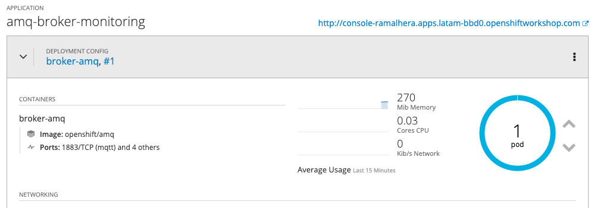
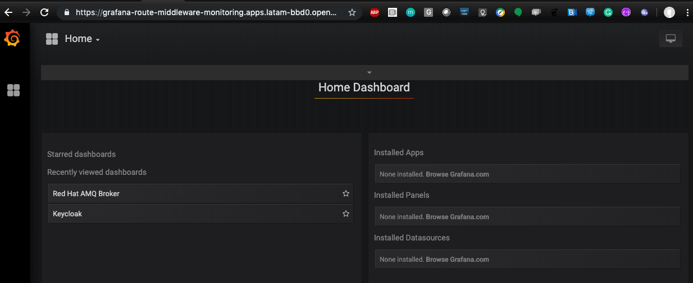
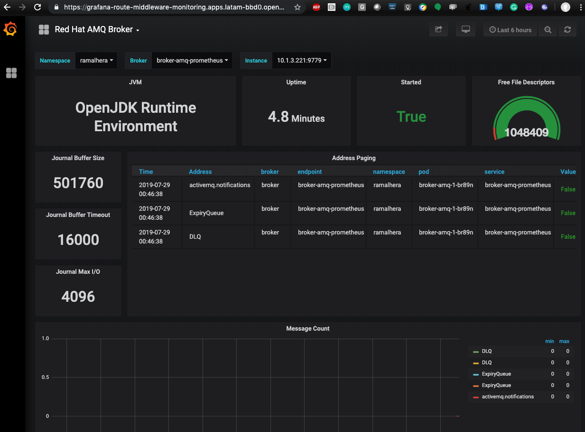

# AMQ 7 (Artemis) Broker with Prometheus Grafana Monitoring enabled

This is an example to how construct an AMQ Broker image with monitoring enabled. 

It was tested on the [Red Hat Integreatly Application Monitoring Operator](https://github.com/integr8ly/application-monitoring-operator) . But it would be easy tweaked to work with your own custom Prometheus/Grafana.

Key steps to enable the AMQ Broker monitoring:

* Expose JMX as Prometheus metrics (Enabled by jmx Prometheus javaagent)
* [Create a service monitor object (scrap metrics to Prometheus)](./service-monitor.yaml)
* [Create a Grafana dashboard object](./grafana-dashboard.yaml)

## Install AMQ 7 into your cluster

Create the imagestream:

```
oc replace --force  -f \
https://raw.githubusercontent.com/jboss-container-images/jboss-amq-7-broker-openshift-image/74-7.4.0.GA/amq-broker-7-image-streams.yaml -n openshift
```

Create the templates: 

```
for template in amq-broker-74-basic.yaml \
amq-broker-74-ssl.yaml \
amq-broker-74-custom.yaml \
amq-broker-74-persistence.yaml \
amq-broker-74-persistence-ssl.yaml \
amq-broker-74-persistence-clustered.yaml \
amq-broker-74-persistence-clustered-ssl.yaml;
 do
 oc replace --force -f \
https://raw.githubusercontent.com/jboss-container-images/jboss-amq-7-broker-openshift-image/74-7.4.0.GA/templates/${template} -n openshift
 done
 ```    

 [More info on Official doc](https://access.redhat.com/documentation/en-us/red_hat_amq/7.4/html-single/deploying_amq_broker_on_openshift_container_platform/index#installing-broker-ocp_broker-ocp)

 
## Build a new custom image into your OpenShift namespace :

```
oc new-build openshift/amq-broker:7.4~https://github.com/hodrigohamalho/amq7-custom --name=amq --build-secret=imagestreamsecret -n openshift
```

If the builds worked properly, now we can deploy the AMQ Broker:

## Create the project and deploy

```
oc new-project monitorz
oc label namespace monitorz monitoring-key=middleware integreatly-middleware-service=true
oc create -f amq-broker-monitoring.yaml
oc new-app amq-broker-monitoring
```

After it, the dashboard will appear on the Kibana. 





